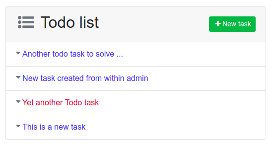
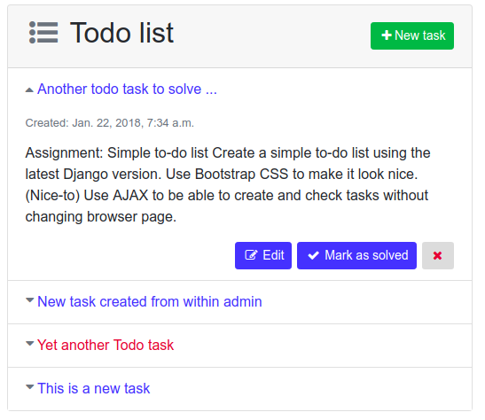
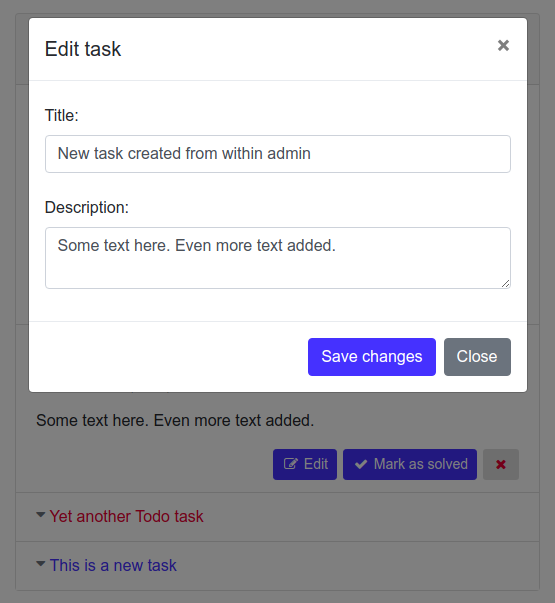
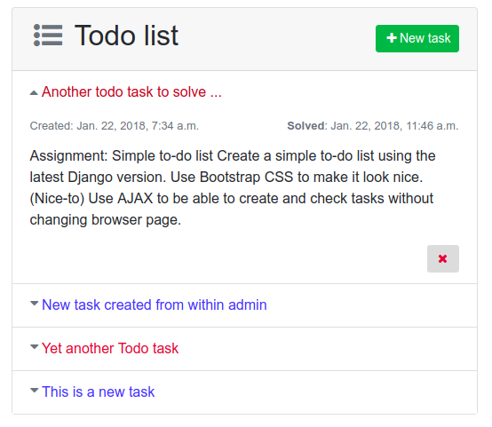

## Library versions used
– Python 3.4.3  
– Django 2.0.1  
– Bootstrap v4.0.0  
– jQuery 3.2.1  

### Functionality
A really simple `TodoItem` model is served by 5 views / urls: `tasks`, `item`, `solve`, `save` and `remove`.  Another view passes the `index` / main template.   All views / urls except `index` is handled via AJAX by `static/todo.js`. 

 
   
#### A list of tasks:  
  
   
#### Tasks can be expanded to view details:  
  

#### A task that is not marked as solved can be edited or removed (besides being marked as solved):  
  
   
#### A solved task get a distinct red colored title. It can no longer be edited but still be removed:   
  
